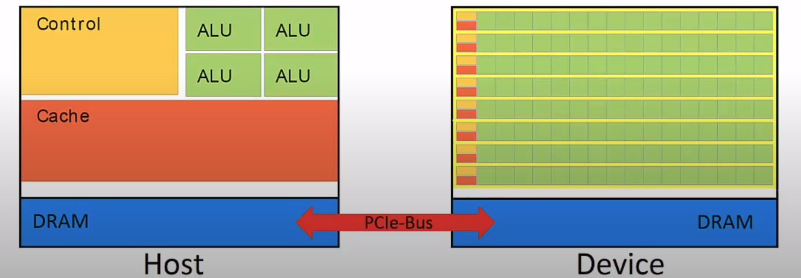
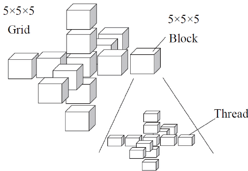

# CUDA Programming Tutorial
Aim: Get started with CUDA programming to leverage high performance computing (HPC).

## CPU and GPU
Parallel computing has gained a lot of interest to improve the speed of program or application execution. This is fundamentally important when real-time computing is required. The parallelism can be achieved by task parallelism or data parallelism. Task parallelism  is more about distributing function to be executed on different cores of CPU. Whereas, CUDA programming focuses more on data parallelism. More specifically, large data can be handled using GPU where data is mapped to threads.

Following diagram shows the architecture of CPU (host) and GPU (device). Data transfer between CPU and GPU is done using PCIe-bus (Peripheral Component Interconnect Express). For the GPU, two important aspects are number of CUDA cores and Memory size.

## Threads, Blocks and Grids
Functions in C/C++ are called kernel in CUDA program. Function with specifier `__global__` is to be executed in GPU. e.g. `__global__ void vector_add(float *out, float *a, float *b, int n)`. Note that the return type of kernel should always be `void` and kernel parameters should be passed by reference. 

Each kernel then launched with configuration parameters given in `<<<M,T>>>>` e.g. `vector_add <<<1,1>>>(d_out, d_a, d_b, N)` where
- M = Number of blocks in grid
- T = Number of threads in block

Figure below illustrates the organization of threads, blocks, and grids

### Threads
- CUDA threads executes in Single Instruction Multiple Thread (SIMT) fashion
- Each threads performs the exactly same task on the subset of data
- Each thread execute independently, have their own register and local memory
- Execution of time threads can be different even though they are executing same kernel. This is because different data flow it takes due to IF condition or FOR loop
- Thread has unique identifier ant it can be accessed using variable `threadIdx` e.g. 'threadIdx.x', 'threadIdx.y', 'threadIdx.z`
- Organization of threads in a block can be 1D, 2D or 3D and it can be accessed using variable `blockDim` e.g. `blockDim.x`, `blockDim.y`, `blockDim.z`

### Blocks
- Group of threads is called a CUDA block
- CUDA blocks are grouped into a grid (see below figure)
- Each block has unique identifier and it can be accessed by variable `blockIdx` giving size and shape of block. e.g. `blockIdx.x`, `blockIdx.y`, `blockIdx.x`
- Each CUDA block is executed by one streaming multiprocessor (SM) and cannot be migrated to other SMs in GPU (except during preemption, debugging, or CUDA dynamic parallelism)
- Blocks may coordinate but not synchronize

### Grids
- CUDA blocks are grouped into a grid
- A kernel is executed as a grid of blocks of threads (see below figure)
- `gridDim` provides size and shape of grid e.g. `gridDim.x`, `gridDim.y`, `gridDimz`

## Indexing
Thread indexing in CUDA C GPU programming depends on the organization of blocks in grid. Following images shows the 1D grid having different block dimensions. 

> `int index = blockIdx.x * blockDim.x + threadIdx.x;`

> NOTE: First block scope index should be specified before going to thread scope

> `int index = blockIdx.x * blockDim.x * blockDim.y + threadIdx.y * blockDim.x + threadIdx.x;`

> `int index = blockIdx.x * blockDim.x * blockDim.y * blockDim.z + threadIdx.z * blockDim.y * blockDim.x + threadIdx.y * blockDim.x + threadIdx.x; `

Following example illustrates the 3d grids and 3d blocks structure. Note that it will look like a 5x5x5 cube but other blocks are not shown for the better visualization.

## Memory Model

### Local Memory and Registers
### Shared Memory
### Global Memory

## Thread Synchronization
### Why and when do we need this?

## Conclusion

## Author
- [Pritesh Gohil](https://github.com/priteshgohil)

## Contributors
- 

## References
- [CUDA Tutorial](https://cuda-tutorial.readthedocs.io/en/latest/#cuda-tutorial)
- [Thread Indexing Visualization](https://github.com/andreajeka/CUDAThreadIndexing)
- [CSC 447: Parallel Programming for Multi-Core and Cluster Systems](http://harmanani.github.io/classes/csc447/Notes/Lecture15.pdf)
