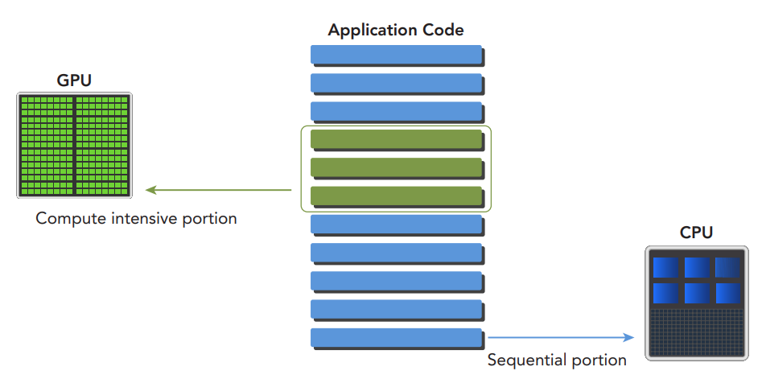
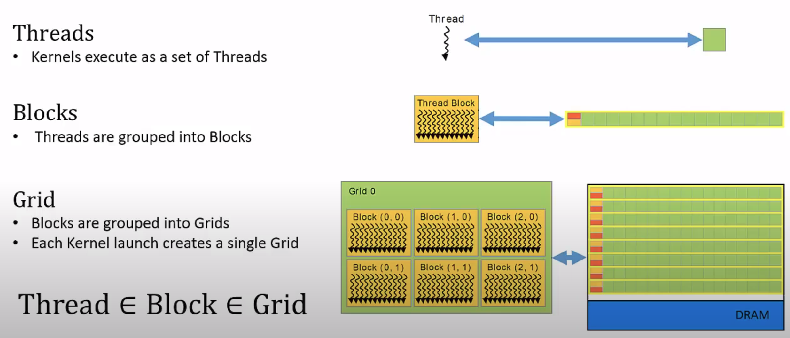

# CUDA Programming Tutorial
Aim: Get started with CUDA programming to leverage high performance computing (HPC).

## CPU and GPU
Parallel computing has gained a lot of interest to improve the speed of program or application execution. This is fundamentally important when real-time computing is required. The parallelism can be achieved by task parallelism or data parallelism. Task parallelism  is more about distributing function to be executed on different cores of CPU. Whereas, CUDA programming focuses more on data parallelism. More specifically, large data can be handled using GPU where data is mapped to threads.

Following diagram shows the architecture of CPU (host) and GPU (device). Data transfer between CPU and GPU is done using PCIe-bus (Peripheral Component Interconnect Express). For the GPU, two important aspects are number of CUDA cores and Memory size.

## Threads, Blocks and Grids
Functions in C/C++ are called kernel in CUDA program. Function with specifier `__global__` is to be executed in GPU. e.g. `__global__ void vector_add(float *out, float *a, float *b, int n)`. Note that the return type of kernel should always be `void`.

Each kernel then launched with configuration parameters given in `<<<M,T>>>>` e.g. `vector_add <<<1,1>>>(d_out, d_a, d_b, N)` where
- M = Number of blocks in grid
- T = Number of threads in block

The maximum dimension of grids and blocks is limited and depends on the CUDA compatibility version (not CUDA version) of GPU.

Figure below illustrates the organization of threads, blocks, and grids

### Threads
- CUDA threads executes in Single Instruction Multiple Thread (SIMT) fashion
- Each threads performs the exactly same task on the subset of data
- Each thread execute independently, have their own register and local memory
- Execution time of threads can be different even though they are executing same kernel. This is because different data flow it takes during IF ELSE condition or FOR loop
- Thread has unique identifier ant it can be accessed using variable `threadIdx` e.g. 'threadIdx.x', 'threadIdx.y', 'threadIdx.z`
- Organization of threads in a block can be 1D, 2D or 3D and it can be accessed using variable `blockDim` e.g. `blockDim.x`, `blockDim.y`, `blockDim.z`

### Blocks
- Group of threads is called a CUDA block
- CUDA blocks are grouped into a grid (see below figure)
- Each block has unique identifier and it can be accessed by variable `blockIdx` giving size and shape of block. e.g. `blockIdx.x`, `blockIdx.y`, `blockIdx.z`
- Each CUDA block is executed by one streaming multiprocessor (SM) and cannot be migrated to other SMs in GPU (except during preemption, debugging, or CUDA dynamic parallelism)
- Blocks may coordinate but not synchronize

### Grids
- CUDA blocks are grouped into a grid
- A kernel is executed as a grid of blocks of threads (see below figure)
- `gridDim` provides size and shape of grid e.g. `gridDim.x`, `gridDim.y`, `gridDim.z`

## Indexing
Thread indexing in CUDA C GPU programming depends on the organization of blocks in grid. Following images shows the 1D grid having different block dimensions. 

- - -
`int index = blockDim.x * blockIdx.x + threadIdx.x;`

`blockDim.x` = number of threads in a block i.e. 4 
`blockIdx.x` = index of the block in the grid  
`threadIdx.x` = index of the thread in the block  

- - - 
NOTE: First block scope index should be specified before going to thread scope

`gridIndex = blockIdx.y * gridDim.x + blockIdx.x = blockIdx.x` (map each 2D block to a unique index in the 1D grid. gridDim.x = 0)  
`threadIndex = threadIdx.y * blockDim.x + threadIdx.x` (unique index for each thread within a 2D block)  
`index = gridIndex * (blockDim.x * blockDim.y) + threadIndex` (unique index for each thread in the 1D grid.) 

`int index = blockIdx.x * blockDim.x * blockDim.y + threadIdx.y * blockDim.x + threadIdx.x;`

`blockDim.x, blockDim.y` = 5, 4  

- - - 
`int index = blockIdx.x * blockDim.x * blockDim.y * blockDim.z + threadIdx.z * blockDim.y * blockDim.x + threadIdx.y * blockDim.x + threadIdx.x;`

- - -
Following example illustrates the 3d grids and 3d blocks structure. Note that it will look like a 5x5x5 cube but other blocks are not shown for the better visualization.

## Memory Model
- The CPU and GPU have separate memory spaces
- This means that data that is processed by the GPU must be moved from the CPU to the GPU before the computation starts, and the results of the computation must be moved back to the CPU once processing has completed. This can be done using `cudaMalloc()` and `cudaMemcpy()`
- Figure below shows the memory structure in GPU

### Local Memory and Registers
- Each thread has its own private local memory
- Only exists for the lifetime of the thread
- Generally handled automatically by the compiler

### Shared Memory
- Each thread block has its own shared memory
- Accessible only by threads within the block
- Much faster than local or global memory
- Requires special handling to get maximum performance
- Only exists for the lifetime of the block

### Global Memory
- This memory is accessible to all threads as well as the host (CPU)
- Global memory is allocated and deallocated by the host
- Used for initializing data that GPU will work on

### Constant and texture memory
- These are read-only memory spaces accessible by all threads
- Constant memory is used to cache values that are shared by all functional units
- Texture memory is optimized for texturing operations provided by the hardware

## Thread Synchronization
### Why and when do we need this?

## Conclusion
This tutorial has covered following points
- Write and launch CUDA C/C++ kernels `__global__ , <<<>>>, blockIdx , threadIdx , blockDim`
- Manage GPU memory `cudaMalloc() , cudaMemcpy() , cudaFree()`
- TODO: Synchronization
- TODO: Device selection

## Author
- [Pritesh Gohil](https://github.com/priteshgohil)

## Contributors
- [FIRSTNAME LASTNAME](GIT_PROFILE_URL)

## References
- [CUDA Tutorial](https://cuda-tutorial.readthedocs.io/en/latest/#cuda-tutorial)
- [Thread Indexing Visualization](https://github.com/andreajeka/CUDAThreadIndexing)
- [CSC 447: Parallel Programming for Multi-Core and Cluster Systems](http://harmanani.github.io/classes/csc447/Notes/Lecture15.pdf)
- [CUDA Programming pro tip](https://developer.nvidia.com/blog/cuda-pro-tip-always-set-current-device-avoid-multithreading-bugs/)
- [CUDA runtime API](https://docs.nvidia.com/cuda/cuda-runtime-api/modules.html#modules)
